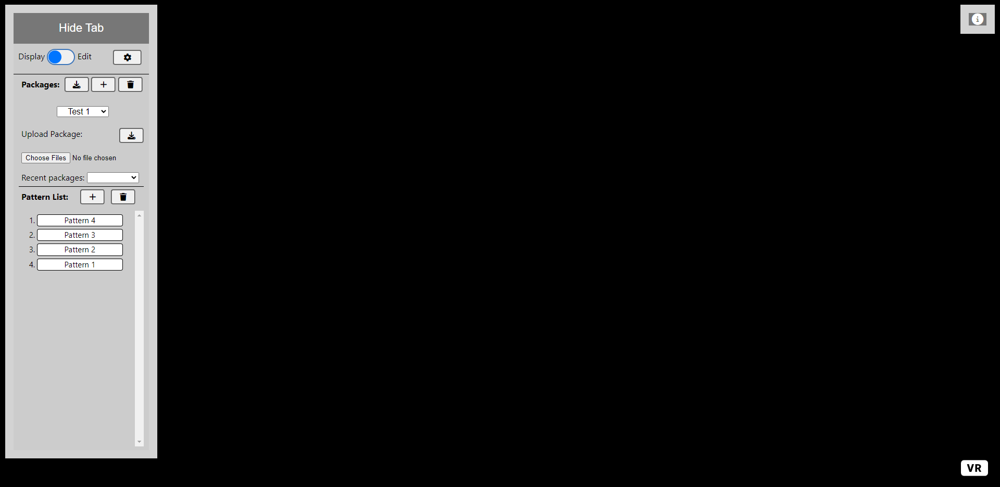
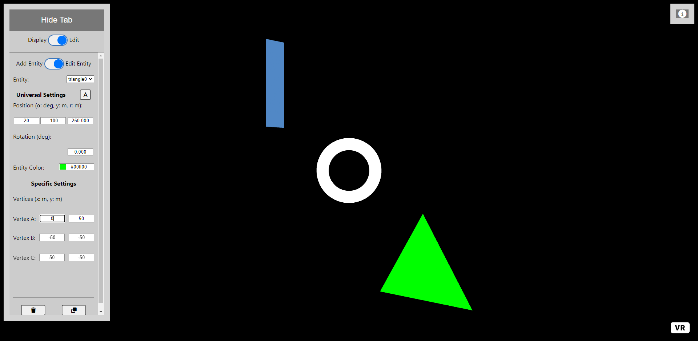
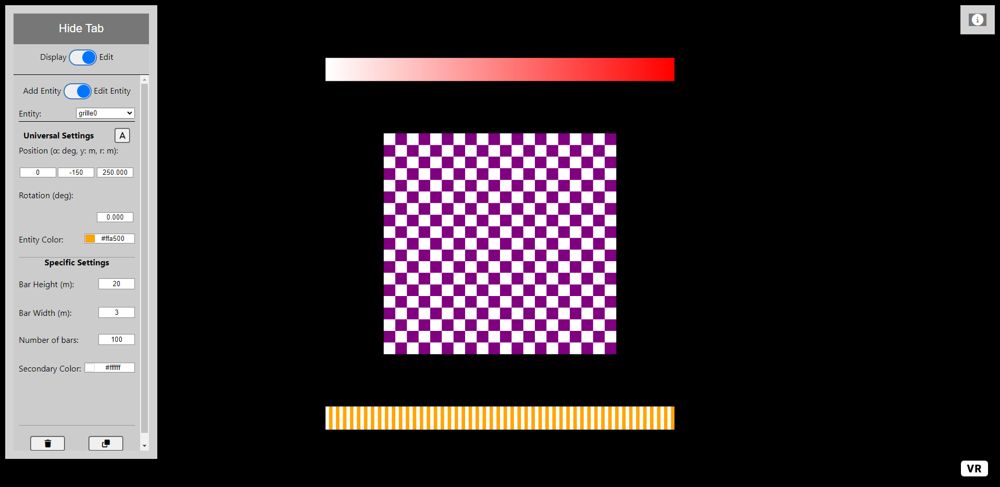
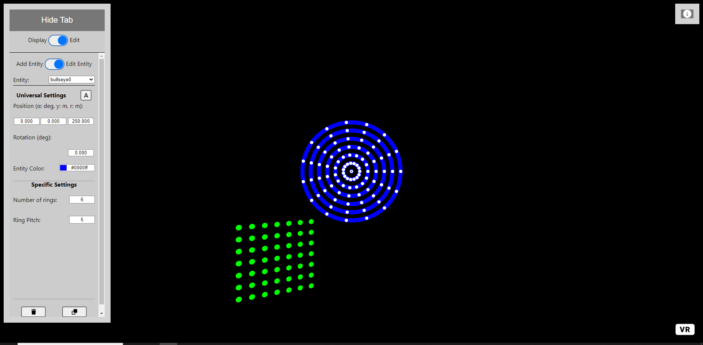

# Manual User Interface Tests #

Begin by opening this link: https://didsr.github.io/WebXR-tools/Custom/

## Test 1- Adding and editing a package
This test will examine the package and pattern systems.  
   1. Add a package with the name "Test 1" by pressing the *plus* icon next to **Packages**
   2. Add three patterns to this package by pressing the *plus* icon next to **Pattern List**
      - Name the first pattern "Pattern 1"
      - Name the second pattern "Pattern 2"
      - Name the third pattern "Pattern 3"

   At this point, the tool should look like this:  
   

   3. Reorder the patterns so that "Pattern 3" is the first pattern, "Pattern 2" is the second pattern, and "Pattern 1" is the last pattern
      - Do this by dragging "Pattern 3" and dropping it in the first position
      - Drag "Pattern 2" and drop it in the second position
   4. Switch packages to the "default" package
   5. Multi-select the patterns "crosshair" and "ring_w2" by holding ctrl while clicking on the patterns
   6. Copy these patterns by pressing Ctrl+c
   7. Switch packages to the "Test 1 Package" package
   8. Paste the copied patterns by pressing Ctrl+v

   At this point, the tool should look like this:
   

## Test 2- Adding and editing a pattern
This test will examine the pattern and entity systems.  
   9. Rename the "crosshair" pattern to "Pattern 4"
       - Select the "crosshair" pattern by clicking on it
       - Open settings by pressing the *gear* icon at the top right of the tab
       - Under **Pattern Settings** select the *Rename* button
       - Enter "Pattern 4" in the textbox and press OK
   10. Delete the "ring_w2" pattern by pressing the *trash* icon next to **Pattern List**
       - Select OK on the confirmation
   11. Close the settings by pressing the *X* icon at the top right of the tab
   11. Reorder the patterns so that "Pattern 4" is first, "Pattern 3" is second, "Pattern 2" is third, and "Pattern 1" is last

   At this point, the tool should look like this:   
   

   12. Select "Pattern 3"
   13. Switch the toggle at the top of the tab to be in *Edit* mode
   14. Add a circle, plane, and triangle to this pattern
       - Select circle as the type of entity to add from the dropdown next to **Type of entity:**
       - Press the *Add to Pattern* button to add it to the pattern
       - Repeat for plane and triangle
       - The entities will spawn at random places on the screen
   15. Switch the second toggle to *Edit Entity* mode
   16. Edit the Circle
       - Click on the circle or select "circle0" from the **Entity** dropdown
       - Move the circle so that it is in position (0, 0, 250)
       - Change the color of the circle to white by selecting it from the color selector or entering #ffffff
       - Increase the radius of the circle to 40m
       - Decrease the border size to 15m
   17. Edit the Plane
       - Click on the plane or select "plane0" from the **Entity** dropdown
       - Move the plane so that it is in position (-20, 100, 250)
       - Change the color of the plane to blue by selecting it from the color selector or entering #0000ff
       - Increase the height of the plane to 100m
       - Decrease the width of the plane to 20m
       - If desired, add a texture from the drop down or upload an image file to use as a texture
          - If an uploaded texture is added here, one step will change in Part 3
          - Adding a texture will rescale the entity to meet the aspect ratio of the image being used
   18. Edit the Triangle
       - Click on the triangle or select "triangle0" from the **Entity** dropdown
       - Move the triangle so that it is in position (20, -100, 250)
       - Change the color of the triangle to green by selecting it from the color selector or entering #00ff00
       - Change vertex A to be at (0, 50)
       - Change vertex B to be at (-50, -50)
       - Change vertex C to be at (50, -50)
   At this point the tool should look like this:

   

   19. Switch the first toggle to *Display* mode
   20. Select "Pattern 2"
   21. Switch the toggle at the top of the tab to be in *Edit* mode
   22. Add a gradient, checkerboard, and grille to this pattern
       - Select gradient as the type of entity to add from the dropdown next to **Type of entity:**
       - Press the *Add to Pattern* button to add it to the pattern
       - Repeat for checkerboard and grille
       - The entities will spawn at random places on the screen
   23. Switch the second toggle to *Edit Entity* mode
   24. Edit the Gradient
       - Click on the gradient or select "gradient0" from the **Entity** dropdown
       - Move the gradient so that it is in position (0, 150, 250)
       - Change the primary color of the gradient to white by selecting it from the color selector or entering #ffffff
       - Increase the bar height to 20m
       - Decrease the bar width to 3m
       - Increase the number of bars to 100
       - Change the secondary color to red by selecting it from the color selector or entering #ff0000
   25. Edit the Checkerboard
       - Click on the checkerboard or select "checkerboard0" from the **Entity** dropdown
       - Move the plane so that it is in position (0, 0, 250)
       - Change the primary color of the checkerboard to purple by selecting it from the color selector or entering #800080
       - Increase the number of columns to 20
       - Increase the number of rows to 19
       - Increase the size of the tiles to 10m
       - Change the secondary color to white by selecting it from the color selector or entering #ffffff
   26. Edit the grille
       - Click on the grille or select "grille0" from the **Entity** dropdown
       - Move the gradient so that it is in position (0, -150, 250)
       - Change the primary color of the grille to orange by selecting it from the color selector or entering #ffa500
       - Decrease the bar height to 20m
       - Decrease the bar width to 3m
       - Increase the number of bars to 100
       - Change the secondary color to white by selecting it from the color selector or entering #ffffff
   At this point the tool should look like this:

   27. Switch the first toggle to *Display* mode
   28. Select "Pattern 1"
   29. Switch the toggle at the top of the tab to be in *Edit* mode
   30. Add a dot array, circular dot array, and bullseye to this pattern
       - Select dot array as the type of entity to add from the dropdown next to **Type of entity:**
       - Press the *Add to Pattern* button to add it to the pattern
       - Repeat for circular dot array and bullseye
       - The entities will spawn at random places on the screen
   31. Switch the second toggle to *Edit Entity* mode
   32. Edit the Dot Array
       - Click on the dot array or select "dotarray0" from the **Entity** dropdown
       - Move the dot array so that it is in position (-20, -100, 250)
       - Change the color of the dot array to green by selecting it from the color selector or entering #00ff00
       - Increase the number of columns to 7
       - Increase the number of rows to 7
       - Increase the radius of the dots to 3m
       - Decrease the spacing of the dots to 5m
       - Toggle on the center dot being filled
   33. Edit the Circular Dot Array
       - Click on the circular dot array or select "circularDotarray0" from the **Entity** dropdown
       - Move the circular dot array so that it is in position (0, 0, 249)
       - Change the color of the dot array to white by selecting it from the color selector or entering #ffffff
       - Increase the number of dots to 15
       - Increase the number of rings to 6
       - Keep the radius of the dots at 2m
       - Keep the spacing of the dots at 10m
       - Keep the center dot hollow
   34. Edit the bullseye
       - Click on the bullseye or select "bullseye0" from the **Entity** dropdown
       - Move the bullseye so that it is in position (0, 0, 250)
       - Change the primary color of the bullseye to blue by selecting it from the color selector or entering #0000ff
       - Increase the number of rings to 6
       - Keep the ring pitch at 5m
At this point the tool should look like this:

## Test 3- Saving and uploading a package
This test will examine the sharing feature of the tool.

   35. Switch the first toggle to *Display* mode
   36. Select the save package button next to **Packages:**
       - Note: if an uploaded texture was used in Test 2, select cancel when prompted to include textures
       - Uploaded textures cause generated files to be too large for the link generation service
   37. Make a note of the package id saved in the url after "?id=" ('?id=<package_id>')
   38. Refresh the page
   39. Ensure that the package "Test 1" is loaded and the patterns are correct
   40. Upload the "Test 1 Comparison" package
       - Open settings by hitting the *gear* icon at the top right of the tab
       - Press the import button denoted by a cloud with a down arrow
       - Paste this link into the textbox: https://didsr.github.io/WebXR-tools/Custom/?id=598zgfm3bqw9
   41. Check that there is now a package called "Test 1 Comparison" with the same patterns as those created in these tests
   42. To interactively check for correct results, navigate between the two packages and ensure entity values are the same
   43. Close the tab completely
   44. Navigate back to the starting page of the tool (https://didsr.github.io/WebXR-tools/Custom/)
   45. Select "Test 1" and "Test 1 Comparison" from the **Recent Packages** dropdown and ensure that they are correct

